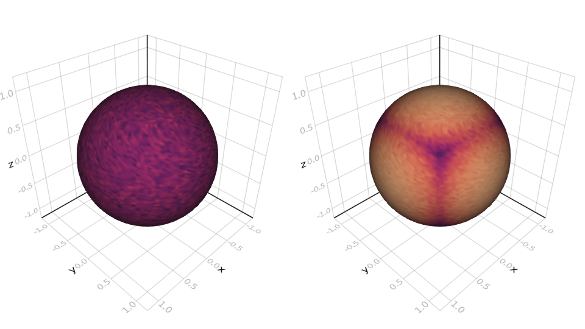

# SphereSurfaceHistogram.jl

`SphereSurfaceHistogram` is a package for binning 3D unit vectors. Each bin has the same size - i.e. it covers the same (curved) area on a unit sphere.

```@contents
```

## Quickstart

An empty histogram binner with approximately `N` bins can be created with

```@repl
using SphereSurfaceHistogram
N = 10_000
binner = SSHBinner(N)
```

Adding vectors can be done using `push!` or `append!`

```@repl
using SphereSurfaceHistogram
N = 10_000
binner = SSHBinner(N)
push!(binner, [1.0, 0.0, 0.0])
append!(binner, [[0.0, 1.0, 0.0], [0.0, 0.0, 1.0]])
```

!!! warning
    SphereSurfaceHistogram does not verify that the given vector is normalized.

## Accessing the Histogram

SphereSurfaceHistogram provides custom getindex methods working with angles in radians.

```@docs
getindex(::SSHBinner, ::Real, ::Real)
```

## Plotting

SphereSurfaceHistogram includes a couple of Makie recipes. Most notably is the `histogram` recipe. It creates a mesh where each vertex represents a bin. Colors are then picked based on the counts in each bin.



The image above uses the following code

```julia
using SphereSurfaceHistogram, Makie
binner1 = SSHBinner(N)
binner2 = SSHBinner(N)
for _ in 1:1000
    append!(binner1, random_unit_vector(1_000))
end
for _ in 1:1000_000
    push!(binner2, normalize(2rand(3) .- 1.0))
end
scene1 = histogram(binner1)
scene2 = histogram(binner2)
vbox(scene1, scene2)
```

!!! info
    Plotting methods are not loaded by default. SphereSurfaceHistogram makes use of `Requires.jl` to dynamically load plotting related methods when `Makie.jl` is used.

!!! info
    Mesh generation methods can also be loaded individually. If you want to use the mesh generation methods without `Makie`, you should import `GeometryTypes.jl`.
